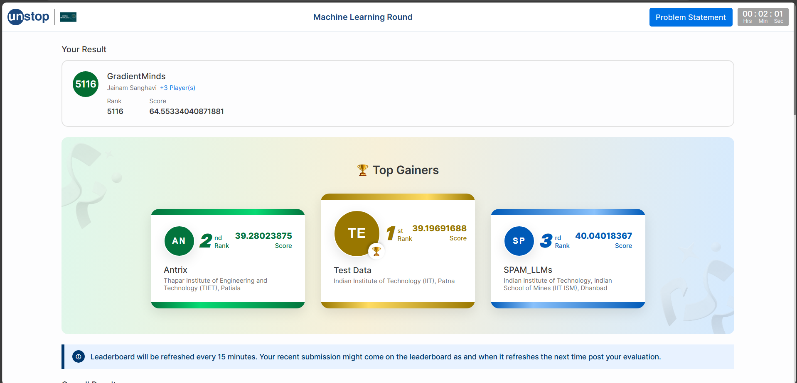

# Amazon ML Challenge 2025 — Team GradientMinds



**Team:** GradientMinds  
**Members:**  
- Sanghavi Jainam Pankajbhai (Leader)  
- Prajapati Kenilkumar Sureshbhai  
- Priyank Zezariya  
- Aryan Mukeshkumar Dave  

---

## About Us

We are currently pursuing our **7th semester of B.Tech in Computer Science and Engineering (Data Science)** from **Vishwakarma Government Engineering College (VGEC), Ahmedabad, Gujarat**.  
This hackathon provided an excellent opportunity to apply our data science and machine learning knowledge to a real-world challenge.

Participating in the **Amazon ML Challenge 2025** was a great learning experience where we gained valuable insights in **data preprocessing, feature engineering, model experimentation, and time management**.  

Although we could not achieve the lowest SMAPE score or submit our final multimodal model due to session issues on Lightning AI, we are proud of our effort and iterative improvements.  
We made a few mistakes — particularly in **time management, workload distribution, and efficient resource utilization** — but those experiences have strengthened our understanding of collaborative ML development.

---

## Problem Statement

### ML Challenge 2025 — Smart Product Pricing Challenge

In e-commerce, determining the optimal price point for products is crucial for marketplace success and customer satisfaction.  
The task was to **develop an ML solution that analyzes product details and predicts the price** of a product.  
The relationship between product attributes and pricing is complex, influenced by factors like **brand, specifications, and quantity**.

### Data Description

- **sample_id**: Unique identifier for each product  
- **catalog_content**: Text containing title, product description, and Item Pack Quantity (IPQ)  
- **image_link**: Public URL to the product image  
- **price**: Target variable (available only in training data)

### Dataset Details

- **Training Dataset:** 75,000 products  
- **Test Dataset:** 75,000 products  

### Output Format

The output must be a CSV file containing:  
- **sample_id** — matching the test record  
- **price** — predicted float value  

---

## Project Overview

This repository documents the complete journey of **Team GradientMinds** in the **Amazon ML Challenge 2025**, where we tackled the **Smart Product Pricing Challenge** using structured, textual, and image-based data.  
Our focus was on designing an efficient ML pipeline and progressively improving the prediction accuracy through experimentation and model optimization.

---

## Model Summary

| Version | Embedding Model | Architecture | Validation SMAPE | Leaderboard SMAPE | Notes |
|----------|-----------------|---------------|------------------|--------------------|-------|
| **1** | `stsb-roberta-base` | Basic MLP | 0.45687 | 82 | Baseline |
| **2** | `stsb-roberta-base` | Optimized MLP (BatchNorm) | 0.33986 | 67 | Major improvement |
| **3** | `stsb-roberta-base` | Residual MLP | 0.37304 | 71 | Slightly higher loss |
| **4** | `bilingual-embedding-large` | Optimized MLP | **0.33250** | **64** | Best-performing |
| **5** | `SigLIP` (text + image) | Multimodal MLP | 0.37556 | — | Not submitted (session timeout) |

---

## Best Model — Model 4

**Embedding:** `Lajavaness/bilingual-embedding-large`  
**Architecture:** Optimized MLP with BatchNorm + LeakyReLU  
**Validation SMAPE:** 0.33250  
**Leaderboard SMAPE:** 64  
**Framework:** TensorFlow 2.x  
**Environment:** Lightning AI (L4OS GPU)

---

## Repository Structure

```

jainam576-gradientminds-amazon-ml-challenge-2025/
├── data/
│   ├── processed/
│   │   ├── test/
│   │   │   ├── final_test_with_category.csv
│   │   │   ├── sample_id_brand_name_test.csv
│   │   │   ├── sample_id_category_test.csv
│   │   │   └── test_image.csv
│   │   └── train/
│   │       ├── final_category.csv
│   │       ├── sample_id_brand_name.csv
│   │       ├── sample_id_category.csv
│   │       └── train_image.csv
│   └── raw/
│       ├── README.md
│       ├── dataset/
│       │   ├── sample_test.csv
│       │   ├── sample_test_out.csv
│       │   ├── test.csv
│       │   └── train.csv
│       └── src/
│           ├── example.ipynb
│           └── utils.py
├── docs/
│   ├── approach.md
│   └── problemdescription.md
├── src/
│   ├── download_save_image.py
│   ├── predict.py
│   ├── process_pipline_test.py
│   └── process_pipline_train.py
└── submissions/
├── model-1/
├── model-2/
├── model-3/
├── model-4/
└── model-5/

```

---

## Key Highlights

- Achieved **SMAPE 64** on the leaderboard.  
- Implemented **transformer-based embeddings** for text data.  
- Experimented with **multimodal learning** (text + image fusion) using **SigLIP**.  
- Enhanced model performance through **data normalization, dropout, and hyperparameter tuning**.  
- Learned effective **data handling, feature extraction, and experimentation strategies**.  
- Faced and overcame **real-world challenges** like GPU constraints, time limits, and submission issues.

---

## Final Thoughts

Although we couldn’t submit our final multimodal model due to session timeouts, the entire journey was a significant learning milestone.  
It helped us realize the importance of **planning, coordination, and efficient pipeline execution** in data science projects.  
We are motivated to continue improving our skills in **multimodal deep learning, optimization, and scalable deployment**.

---


## Future Work

- Enhance the multimodal model by improving **image-text embedding fusion** and fine-tuning **SigLIP** jointly with structured features.  
- Utilize **larger compute resources (A100/H100 GPUs)** for faster experimentation and model tuning.  
- Incorporate **cross-validation** and **model ensembling** to reduce generalization error.  
- Automate the **data preprocessing and feature engineering** pipeline for scalable experimentation.  
- Deploy the final model as an **interactive pricing assistant** using Streamlit or FastAPI.

---

**Repository maintained by Team GradientMinds**  
*(Last updated: October 2025)*  

For any queries, contact: **sanghavijainam86@gmail.com**


