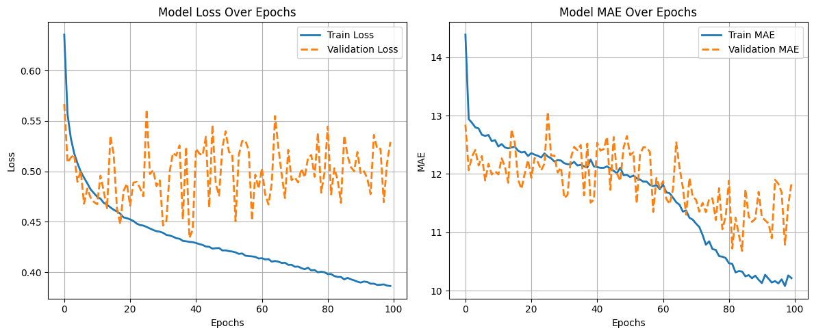

#  Model 1 — MLP with SentenceTransformer Embeddings

###  Folder Contents
```

model-1/
├── model_preprocess_training.ipynb    # Data preprocessing + model training
├── model.h5                           # Trained MLP model weights
├── process_pipeline.pkl               # Saved preprocessing pipeline (scaler + encoder)
├── test_out.csv                       # Model predictions on test.csv
├── epochs_vs_metrics.png              # Training curve (Epoch vs SMAPE)
└── README.md                          # Documentation for this model

```

---

##  Overview
This model combines **structured features** and **semantic text embeddings** to predict product prices as part of the **Amazon ML Challenge 2025**.  
It leverages **SentenceTransformer (stsb-roberta-base)** for encoding textual product descriptions and an **MLP architecture** for regression.

---

##  Features Used

###  **Numeric Features**
- `unit_qty`
- `pack_count`
- `total_qty`
- `num_bullet_points`
- `num_product_desc`
- `total_chars_bullet_points`
- `total_chars_product_desc`
- `avg_bullet_point_len`

###  **Categorical Features**
- `unit`
- `brand_name`
- `category`

###  **Text Feature**
- `catalog_content` → encoded using `SentenceTransformer('stsb-roberta-base')`

###  **Preprocessing**
- Numeric: `StandardScaler`
- Categorical: `TargetEncoder`  
- Text: `SentenceTransformer` → embeddings concatenated with numeric + categorical features  
- Total combined features: **778**

---

##  Model Architecture (MLP)

| Layer | Units | Activation | Dropout |
|:------|:------:|:-----------|:---------:|
| Dense_1 | 128 | ReLU | 0.4 |
| Dense_2 | 128 | LeakyReLU(0.1) | 0.2 |
| Dense_3 | 256 | ReLU | 0.1 |
| Dense_4 | 512 | ReLU | 0.2 |
| Output | 1 | Linear | — |

**Optimizer:** RMSprop  
**Learning Rate:** 0.0002256574510240418  
**Loss Function:** Custom SMAPE Loss  
**Metric:** Mean Absolute Error (MAE)

---

##  Training Configuration

| Parameter | Value |
|:-----------|:------|
| Epochs | 100 |
| Batch Size | 128 |
| Validation Split | 0.2 |
| Callbacks | ModelCheckpoint |
| Environment | Google Colab T4 GPU |
| Python Version | 3.11 |
| Framework | TensorFlow 2.x |

---

##  Validation Performance

| Metric | Value |
|:--------|:------:|
| Validation SMAPE Loss | **0.45687** |

 *Training Curve:*  


---

##  Evaluation on Test Data
| Metric | Value |
|:--------|:------:|
| SMAPE (Amazon Evaluation) | **82.00** |

> **Note:**
>
> * SMAPE (Symmetric Mean Absolute Percentage Error) is measured in **percent (%)**.
> * Its range is typically **0 – 200 %**, where **lower values indicate better model performance**.
---

##  Insights
- SentenceTransformer embeddings (`stsb-roberta-base`) improved text understanding significantly.  
- Model started overfitting slightly after ~70 epochs; early stopping could further help.  
- RMSprop provided smoother convergence compared to Adam in initial trials.  

---

##  Artifacts
- [`model.h5`](./model.h5) — trained MLP model  
- [`process_pipeline.pkl`](./process_pipeline.pkl) — preprocessing pipeline  
- [`test_out.csv`](./test_out.csv) — predictions on test dataset  
- [`epochs_vs_metrics.png`](./epochs_vs_metrics.png) — validation performance curve  
- [`model_preprocess_training.ipynb`](./model_preprocess_training.ipynb) — full training notebook

---

##  Leaderboard Result
> **Public Leaderboard SMAPE Score:** 82  
> **Status:** ✅ Successfully evaluated on Amazon ML Challenge 2025

---

###  Author
**Team GradientMinds**  
- Sanghavi Jainam Pankajbhai (Leader)  
- Priyank Zezariya  
- Prajapati Kenilkumar Sureshbhai  
- Aryan Mukeshkumar Dave

