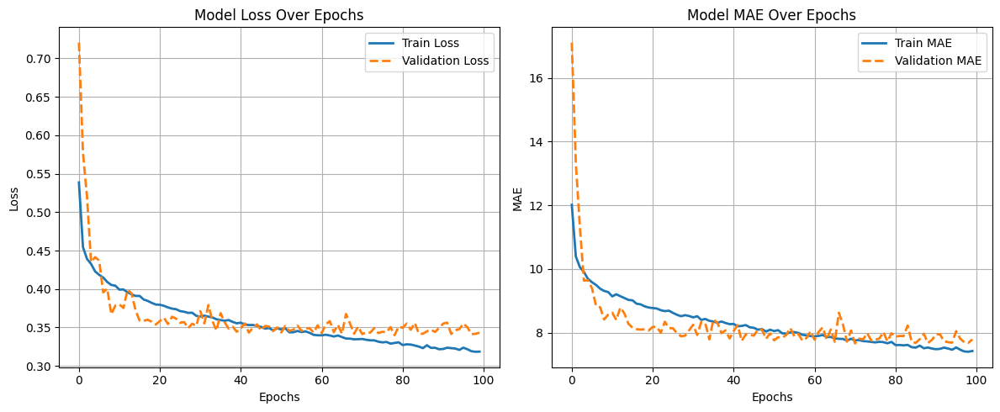

# Model 2 — Optimized MLP with Batch Normalization and LeakyReLU

###  Folder Contents
```

model-2/
├── model_preprocess_training.ipynb    # Data preprocessing + model training
├── model.h5                           # Trained MLP model weights
├── process_pipeline.pkl               # Saved preprocessing pipeline (scaler + encoder)
├── test_out.csv                       # Model predictions on test.csv
├── epochs_vs_metrics.png              # Training curve (Epoch vs SMAPE)
└── README.md                          # Documentation for this model

```

---

##  Overview
This model builds upon **Model 1** by improving architecture depth, normalization, and optimizer strategy.  
The preprocessing pipeline and feature setup remain identical, but the network now uses **Batch Normalization** and **LeakyReLU activations** for better convergence stability.  
Training was conducted on **Google Colab (T4 GPU)** for 100 epochs.

---

##  Features Used
Same as Model 1 — combining structured features and text embeddings.

###  **Numeric Features**
- `unit_qty`
- `pack_count`
- `total_qty`
- `num_bullet_points`
- `num_product_desc`
- `total_chars_bullet_points`
- `total_chars_product_desc`
- `avg_bullet_point_len`

###  **Categorical Features**
- `unit`
- `brand_name`
- `category`

###  **Text Feature**
- `catalog_content` → encoded via `SentenceTransformer('stsb-roberta-base')`

###  **Preprocessing**
- Numeric: `StandardScaler`
- Categorical: `TargetEncoder`
- Text: Sentence embeddings concatenated with structured data  
- Total combined features: **778**

---

##  Model Architecture (Optimized MLP)

| Layer | Units | Activation | Normalization | Dropout |
|:------|:------:|:-----------|:--------------:|:---------:|
| Dense_1 | 512 | LeakyReLU(0.1) | ✅ | 0.3 |
| Dense_2 | 256 | LeakyReLU(0.1) | ✅ | 0.25 |
| Dense_3 | 128 | LeakyReLU(0.1) | ✅ | 0.2 |
| Dense_4 | 64 | ReLU | — | 0.15 |
| Output | 1 | Linear | — | — |

**Optimizer:** Adam  
**Learning Rate:** 0.001  
**Loss Function:** Custom SMAPE Loss  
**Metric:** Mean Absolute Error (MAE)

---

##  Training Configuration

| Parameter | Value |
|:-----------|:------|
| Epochs | 100 |
| Batch Size | 128 |
| Validation Split | 0.2 |
| Callbacks | ModelCheckpoint |
| Environment | Google Colab T4 GPU |
| Python Version | 3.11 |
| Framework | TensorFlow 2.x |

---

##  Validation Performance

| Metric | Value |
|:--------|:------:|
| Validation SMAPE Loss | **0.33986** |

📈 *Training Curve:*  


---

##  Evaluation on Test Data
| Metric | Value |
|:--------|:------:|
| SMAPE (Amazon Evaluation) | **67.00** |

> **Note:**
>
> * SMAPE (Symmetric Mean Absolute Percentage Error) is measured in **percent (%)**.
> * Its range is typically **0 – 200 %**, where **lower values indicate better model performance**.

---

##  Insights
- Addition of **BatchNormalization** and **LeakyReLU** improved gradient flow and stability.  
- Switched from RMSprop to **Adam optimizer**, yielding faster convergence.  
- Reduced overfitting via moderate dropout (0.15–0.3 range).  
- Achieved significant improvement from previous model:  
  **Validation SMAPE ↓ from 0.456 → 0.339**,  
  **Leaderboard SMAPE ↓ from 82 → 67.**

---

##  Artifacts
- [`model.h5`](./model.h5) — trained model weights  
- [`process_pipeline.pkl`](./process_pipeline.pkl) — preprocessing pipeline  
- [`test_out.csv`](./test_out.csv) — test predictions  
- [`epochs_vs_metrics.png`](./epochs_vs_metrics.png) — training curve  
- [`model_preprocess_training.ipynb`](./model_preprocess_training.ipynb) — notebook

---

##  Leaderboard Result
> **Public Leaderboard SMAPE Score:** 67  
> **Status:** ✅ Improved performance over Model 1

---

###  Author
**Team GradientMinds**  
- Sanghavi Jainam Pankajbhai (Leader)  
- Priyank Zezariya  
- Prajapati Kenilkumar Sureshbhai  
- Aryan Mukeshkumar Dave

