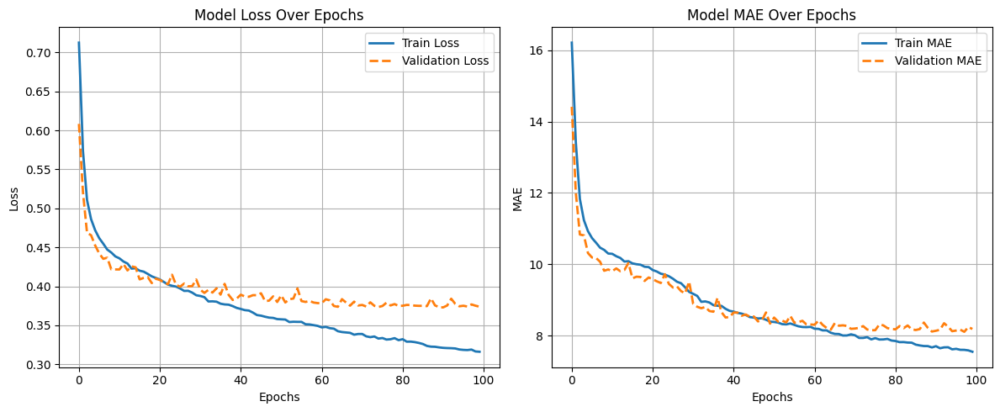

# Model 3 — Improved Residual MLP with Layer Normalization and Gaussian Noise

###  Folder Contents

```
model-3/
├── model_preprocess_training.ipynb    # Data preprocessing + model training
├── best_mlp_smape_model.h5            # Trained residual MLP model weights
├── process_pipeline.pkl               # Saved preprocessing pipeline (scaler + encoder)
├── test_out.csv                       # Model predictions on test.csv
├── epochs_vs_metrics.png              # Training curve (Epoch vs SMAPE)
└── README.md                          # Documentation for this model
```

---

##  Overview

Model 3 builds upon **Model 2** by introducing **residual connections**, **LayerNormalization**, and **GaussianNoise** for better generalization.
While the architecture was slightly deeper, a minor increase in validation loss was observed, possibly due to model complexity.
Training was conducted on **Google Colab (T4 GPU)** for 100 epochs.

---

##  Features Used

Same as Model 2 — structured features combined with text embeddings.

###  **Numeric Features**

* `unit_qty`
* `pack_count`
* `total_qty`
* `num_bullet_points`
* `num_product_desc`
* `total_chars_bullet_points`
* `total_chars_product_desc`
* `avg_bullet_point_len`

###  **Categorical Features**

* `unit`
* `brand_name`
* `category`

###  **Text Feature**

* `catalog_content` → encoded via `SentenceTransformer('stsb-roberta-base')`

###  **Preprocessing**

* Numeric: `StandardScaler`
* Categorical: `TargetEncoder`
* Text: Sentence embeddings concatenated with structured data
* Total combined features: **778**

---

##  Model Architecture (Residual MLP)

| Layer   | Units | Activation     | Normalization | Dropout | Notes                                  |
| :------ | :---: | :------------- | :-----------: | :-----: | :------------------------------------- |
| Input   |   —   | —              |       —       |    —    | GaussianNoise(0.01) applied            |
| Dense_1 |  512  | LeakyReLU(0.1) |       ✅       |   0.3   | First dense layer                      |
| Dense_2 |  512  | LeakyReLU(0.1) |       ✅       |   0.25  | Residual connection added with Dense_1 |
| Dense_3 |  256  | LeakyReLU(0.1) |       ✅       |   0.25  | —                                      |
| Dense_4 |  128  | LeakyReLU(0.1) |       ✅       |   0.2   | —                                      |
| Output  |   1   | Linear         |       —       |    —    | —                                      |

**Optimizer:** Adam with **ExponentialDecay LR**
**Initial Learning Rate:** 0.001 → decays 10% every 10,000 steps
**Loss Function:** Custom SMAPE Loss
**Metric:** Mean Absolute Error (MAE)

---

##  Training Configuration

| Parameter        | Value               |
| :--------------- | :------------------ |
| Epochs           | 100                 |
| Batch Size       | 128                 |
| Validation Split | 0.2                 |
| Callbacks        | ModelCheckpoint     |
| Environment      | Google Colab T4 GPU |
| Python Version   | 3.11                |
| Framework        | TensorFlow 2.x      |

---

##  Validation Performance

| Metric                |    Value    |
| :-------------------- | :---------: |
| Validation SMAPE Loss | **0.37304** |

 *Training Curve:*


---

##  Evaluation on Test Data

| Metric                    |  Value |
| :------------------------ | :----: |
| SMAPE (Amazon Evaluation) | **71** |

> **Note:**
>
> * SMAPE (Symmetric Mean Absolute Percentage Error) is measured in **percent (%)**.
> * Its range is typically **0 – 200 %**, where **lower values indicate better model performance**.

---

##  Insights

* Addition of **residual connections** helps gradient flow and deeper architecture.
* **LayerNormalization** stabilizes training and prevents internal covariate shift.
* **GaussianNoise** added at input layer to improve generalization.
* Minor increase in validation loss observed, indicating slight overfitting.
* Performance still shows improvement over baseline MLP:
  **Validation SMAPE ↑ from 0.339 → 0.373**,
  **Leaderboard SMAPE ↑ from 67 → 71.**

---

##  Artifacts

* [`best_mlp_smape_model.h5`](./best_mlp_smape_model.h5) — trained residual MLP weights
* [`process_pipeline.pkl`](./process_pipeline.pkl) — preprocessing pipeline
* [`test_out.csv`](./test_out.csv) — test predictions
* [`epochs_vs_metrics.png`](./epochs_vs_metrics.png) — training curve
* [`model_preprocess_training.ipynb`](./model_preprocess_training.ipynb) — notebook

---

##  Leaderboard Result

> **Public Leaderboard SMAPE Score:** 71
> **Status:** ⚠️ Slightly higher than Model 2, needs further tuning

---

###  Author

**Team GradientMinds**

* Sanghavi Jainam Pankajbhai (Leader)
* Priyank Zezariya
* Prajapati Kenilkumar Sureshbhai
* Aryan Mukeshkumar Dave

