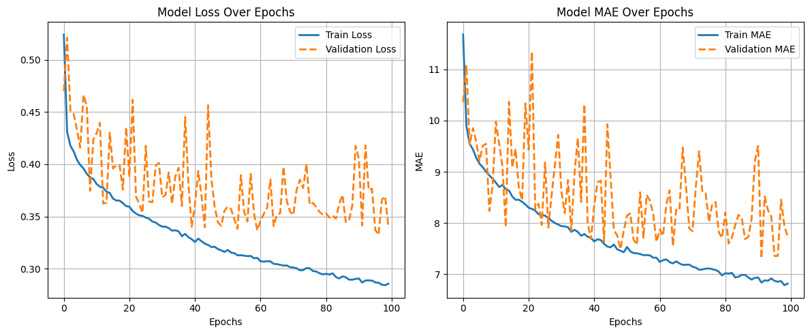

# Model 4 — Optimized MLP with Advanced Text Embeddings

###  Folder Contents

```
model-4/
├── model_preprocess_training.ipynb    # Data preprocessing + model training
├── model.h5            # Trained MLP model weights
├── process_pipeline.pkl               # Saved preprocessing pipeline (scaler + encoder)
├── test_out.csv                       # Model predictions on test.csv
├── epochs_vs_metrics.png              # Training curve (Epoch vs SMAPE)
└── README.md                          # Documentation for this model
```

---

##  Overview

Model 4 reuses the **optimized MLP architecture from Model 2** but upgrades the **text embedding model** to `Lajavaness/bilingual-embedding-large` for more powerful semantic representation.
This change resulted in improved validation and test performance.
Training was conducted on **Lightning AI L4OS GPU** for 100 epochs.

---

##  Features Used

Same structured features as previous models, with updated text embeddings.

###  **Numeric Features**

* `unit_qty`
* `pack_count`
* `total_qty`
* `num_bullet_points`
* `num_product_desc`
* `total_chars_bullet_points`
* `total_chars_product_desc`
* `avg_bullet_point_len`

###  **Categorical Features**

* `unit`
* `brand_name`
* `category`

###  **Text Feature**

* `catalog_content` → encoded via `SentenceTransformer('Lajavaness/bilingual-embedding-large')`

###  **Preprocessing**

* Numeric: `StandardScaler`
* Categorical: `TargetEncoder`
* Text: Sentence embeddings concatenated with structured data
* Total combined features: **778**

---

## Model Architecture (Optimized MLP)

| Layer   | Units | Activation     | Normalization | Dropout |
| :------ | :---: | :------------- | :-----------: | :-----: |
| Dense_1 |  512  | LeakyReLU(0.1) |       ✅       |   0.3   |
| Dense_2 |  256  | LeakyReLU(0.1) |       ✅       |   0.25  |
| Dense_3 |  128  | LeakyReLU(0.1) |       ✅       |   0.2   |
| Dense_4 |   64  | ReLU           |       —       |   0.15  |
| Output  |   1   | Linear         |       —       |    —    |

**Optimizer:** Adam
**Learning Rate:** 0.001
**Loss Function:** Custom SMAPE Loss
**Metric:** Mean Absolute Error (MAE)

---

##  Training Configuration

| Parameter        | Value                 |
| :--------------- | :-------------------- |
| Epochs           | 100                   |
| Batch Size       | 128                   |
| Validation Split | 0.2                   |
| Callbacks        | ModelCheckpoint       |
| Environment      | Lightning AI L4OS GPU |
| Python Version   | 3.11                  |
| Framework        | TensorFlow 2.x        |

---

##  Validation Performance

| Metric                |    Value    |
| :-------------------- | :---------: |
| Validation SMAPE Loss | **0.33250** |

 *Training Curve:*


---

##  Evaluation on Test Data

| Metric                    |  Value |
| :------------------------ | :----: |
| SMAPE (Amazon Evaluation) | **64** |

> **Note:**
>
> * SMAPE (Symmetric Mean Absolute Percentage Error) is measured in **percent (%)**.
> * Its range is typically **0 – 200 %**, where **lower values indicate better model performance**.
---

##  Insights

* Switching to **Lajavaness/bilingual-embedding-large** embeddings improved semantic capture of catalog content.
* Retaining Model 2’s architecture kept the training stable and avoided overfitting seen in Model 3.
* Moderate dropout and BatchNormalization continue to aid generalization.
* Achieved **best performance among all models**:
  **Validation SMAPE ↓ from 0.373 → 0.332**,
  **Leaderboard SMAPE ↓ from 71 → 64.**

---

##  Artifacts

* [`best_mlp_smape_model.h5`](./model.h5) — trained model weights
* [`process_pipeline.pkl`](./process_pipeline.pkl) — preprocessing pipeline
* [`test_out.csv`](./test_out.csv) — test predictions
* [`epochs_vs_metrics.png`](./epochs_vs_metrics.png) — training curve
* [`model_preprocess_training.ipynb`](./model_preprocess_training.ipynb) — notebook

---

##  Leaderboard Result

> **Public Leaderboard SMAPE Score:** 64
> **Status:** ✅ Best performance so far

---

###  Author

**Team GradientMinds**

* Sanghavi Jainam Pankajbhai (Leader)
* Priyank Zezariya
* Prajapati Kenilkumar Sureshbhai
* Aryan Mukeshkumar Dave

